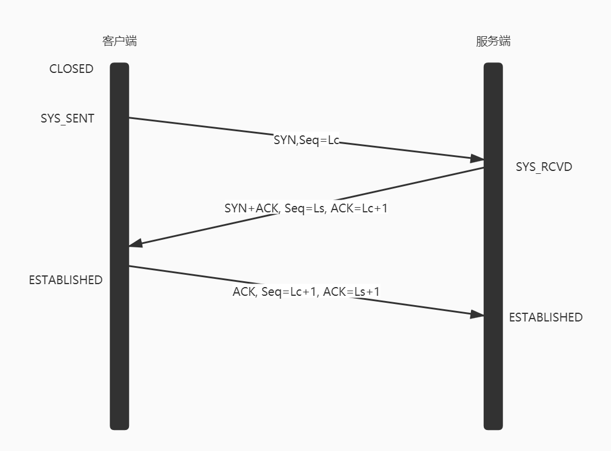
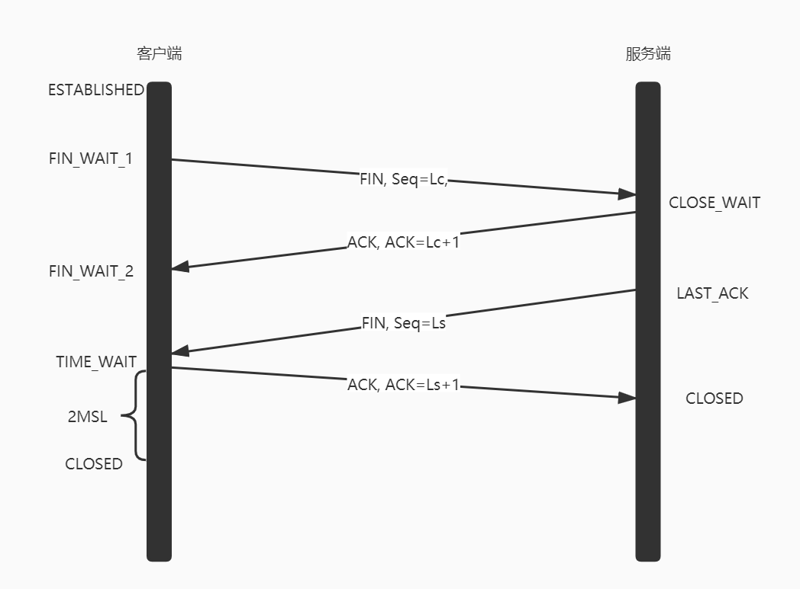

# TCP三次握手与四次挥手

## 三次握手



### 为什么需要三次握手

 引用网络搜到的原文(据说来源《计算机网络》)：

> 已失效的连接请求报文段”的产生在这样一种情况下：client发出的第一个连接请求报文段并没有丢失，而是在某个网络结点长时间的滞留了，以致延误到连接释放以后的某个时间才到达server。本来这是一个早已失效的报文段。但server收到此失效的连接请求报文段后，就误认为是client再次发出的一个新的连接请求。于是就向client发出确认报文段，同意建立连接。假设不采用“三次握手”，那么只要server发出确认，新的连接就建立了。由于现在client并没有发出建立连接的请求，因此不会理睬server的确认，也不会向server发送数据。但server却以为新的运输连接已经建立，并一直等待client发来数据。这样，server的很多资源就白白浪费掉了。采用“三次握手”的办法可以防止上述现象发生。例如刚才那种情况，client不会向server的确认发出确认。server由于收不到确认，就知道client并没有要求建立连接。”

**思考:** 三次握手实际是将连接建立的控制权交给了客户端（note: 主动发起连接的一方），必须客户端确认后才会建立，避免无效的资源浪费。如果是二次握手，那么控制权在服务端，就会出现上文的情况。而四次乃至更多次的握手，本质上与二次/三次握手没有区别，反而浪费资源，没有必要。

​	三次握手可能会让客户端错误的处于ESTABLISHED状态，但考虑到客户端与服务端的角色，客户端的资源浪费处于可接受范围，基本不会出现大量连接都实际处于半连接状态进而导致服务不可用的情况。

### 三次握手中的超时

* 客户端发送SYN后，处于SYN_SENT状态，等待SYN+ACK超时；
* 服务端收到SYN，发送SYN_ACK后，处于SYN_RCVD状态，等待ACK超时；

等待超时后重传，超过最大重传次数后，终止连接创建。

### Linux下的相关参数

> - tcp_syn_retries (integer; default: 5; since Linux 2.2)
>
>   The maximum number of times initial SYNs for an active TCP connection attempt will be retransmitted. This value should not be higher than 255. The default value is 5, which corresponds to approximately 180 seconds.
>
> - tcp_synack_retries (integer; default: 5; since Linux 2.2)
>
>   The maximum number of times a SYN/ACK segment for a passive TCP connection will be retransmitted. This number should not be higher than 255.


```bash
cat /proc/sys/net/ipv4/tcp_synack_retries
cat /proc/sys/net/ipv4/tcp_syn_retries
```


### 可能出现的情况

* 1）客户端ESTABLISHED, 服务端SYN_RCVD

  此时客户端发送数据包时会携带ACK，服务端收到后自动完成连接建立过程，转变为ESTABLISHED。

* 2）客户端ESTABLISHED, 服务端SYS_RCVD等待超时，即终止创建该连接

  客户端在实际不存在的连接上发送报文，服务端返回RST。(未验证)

## 四次挥手



### 为什么需要四次挥手

客户端（或者服务端）主动断开连接时，可能对端还在发送数据，因此此时只需要对端回馈ACK消息，然后等待数据传输完成。服务端（或者客户端）数据传输完成后，发送FIN消息给对端，表明此时可以关闭了。

**最后一次FIN发送后不能立即关闭，必须等待ACK，避免对端未收到FIN消息，造成资源浪费**

* #### 为什么TIME_WAIT要等待2MSL

  MSL为最大段生存期。等待2MSL是为了确保对端收到了ACK。

  进入TIME_WAIT状态后，对端FIN报文的等待超时时间应当是小于MSL的。

  引用网络原文（参考二）：

  > 两个理由：
  >
  > - 保证客户端发送的最后一个ACK报文段能够到达服务端。
  >
  > 这个ACK报文段有可能丢失，使得处于LAST-ACK状态的B收不到对已发送的FIN+ACK报文段的确认，服务端超时重传FIN+ACK报文段，而客户端能在2MSL时间内收到这个重传的FIN+ACK报文段，接着客户端重传一次确认，重新启动2MSL计时器，最后客户端和服务端都进入到CLOSED状态，若客户端在TIME-WAIT状态不等待一段时间，而是发送完ACK报文段后立即释放连接，则无法收到服务端重传的FIN+ACK报文段，所以不会再发送一次确认报文段，则服务端无法正常进入到CLOSED状态。
  >
  > - 防止“已失效的连接请求报文段”出现在本连接中。
  >
  > 客户端在发送完最后一个ACK报文段后，再经过2MSL，就可以使本连接持续的时间内所产生的所有报文段都从网络中消失，使下一个新的连接中不会出现这种旧的连接请求报文段。

### 四次挥手中的超时

* FIN_WAIT_1状态超时

  引用网络原文（参考三）：

  > - **如果主动断开端调用了close关掉了进程，它会进入FIN_WAIT1状态，此时如果它再也收不到ACK，无论是针对pending在发送缓冲的数据还是FIN，它都会尝试重新发送，在收到ACK前会尝试N次退避，该N由tcp_orphan_retries参数控制。**

* FIN_WAIT_2状态超时

  超时后放弃这条连接。linux下由tcp_fin_timeout参数控制。

  
```bash
  cat /proc/sys/net/ipv4/tcp_fin_timeout
  ```


* TIME_WAIT状态超时

  见参考四。

* LAST_ACK超时

  见参考五。

## 参考文章

[参考一: TCP协议中的超时](http://blog.qiusuo.im/blog/2014/03/19/tcp-timeout/)

[参考二: TCP三次握手与四次挥手](https://zhuanlan.zhihu.com/p/86426969)

[参考三: TCP在FIN_WAIT1状态到底能持续多久以及TCP假连接问题](https://blog.csdn.net/dog250/article/details/81697403)

[参考四: TCP中的超时和Linux参数](http://blog.qiusuo.im/blog/2014/03/19/tcp-timeout/)

[参考五: LAST_ACK状态收不到ACK](https://www.zhihu.com/question/27564314)

[参考六: 面试官：换人！他连 TCP 这几个参数都不懂](https://zhuanlan.zhihu.com/p/146752547)

## 补充

### 针对参考三的补充：

nc（netcat）安装：


```bash
yum install nc -y
```


以及实验一中iptables命令，需替换为：


```bash
iptables -A INPUT -p tcp -s 1.1.1.1 --tcp-flags ACK,FIN ACK -j DROP
```
